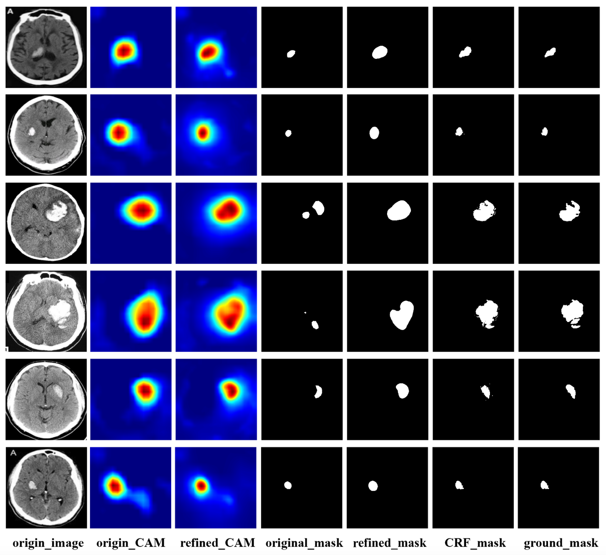
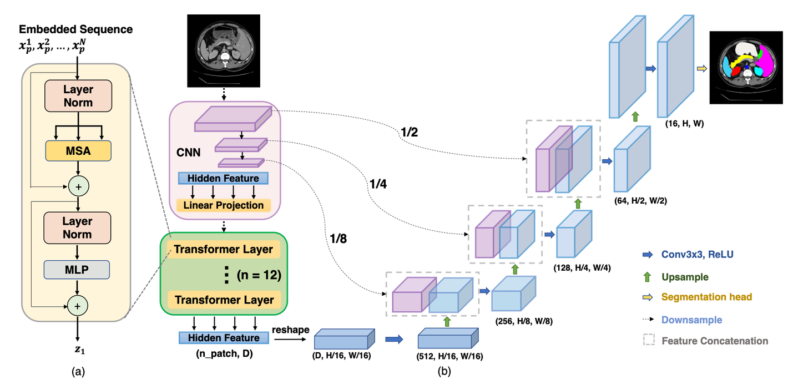
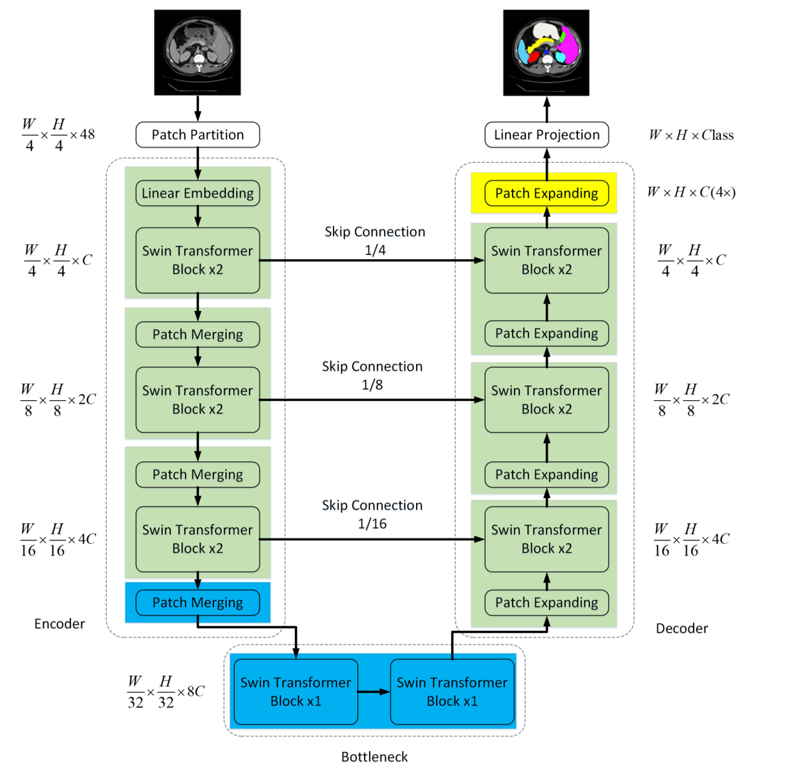

# MRI分割——自动化生成像素级标签

> 该项目成功申请了“中央高校基本科研业务专项资金”本科生项目

[项目代码](https://github.com/Samer-hue/DicTED)

> 深度学习技术在医学图像处理领域展现了卓越的能力，尤其是在医学图像中精准定位和分割病灶。然而，训练这些分割模型需要大量由专业医生手动标注的像素级标签，相较于更易获取的图像级标签，这一过程既耗时又费力。因此，我们致力于开发基于MRI图像级标签的自动化方法，以生成像素级标签。

## 技术背景与挑战

近年来，深度学习技术在医学图像处理，尤其是磁共振成像（MRI）和计算机断层扫描（CT）上的病变定位与分割方面，展现出了卓越的能力。然而，训练这些分割模型往往需要大量由专业医生手动标注的**像素级标签**，这一过程比获取相对容易的**图像级标签**更为耗时且费力。经过广泛调研，我们希望通过采用图像级标签作为监督，开发一种弱监督语义分割模型，以应对这一挑战。基于现有的研究成果，我们对**弱监督分割**模型进行了优化设计，力求实现自动化和高效性。

## 解决方案

我们的解决方案主要分为**分类**和**分割**两部分：

### 分类（生成像素级标签）

- 采用选定的卷积神经网络（如 ResNet）在公开的图像级标签数据集（如 RSNA2019）上进行分类训练。
- 使用 CAM 推理来判断分类网络的关注点，生成 Mask。
- 通过 CRF 优化 Mask，生成像素级标签。
- 将生成的像素级标签与专家标注的 Ground Mask 进行效果对比。

### 分割（将像素级标签作为分割模型的输入）

使用分类任务生成的像素级标签来训练分割网络（如 Deeplabv3、Trans-Unet、Swin-Unet、MT-Unet），完成弱监督分割流程。

